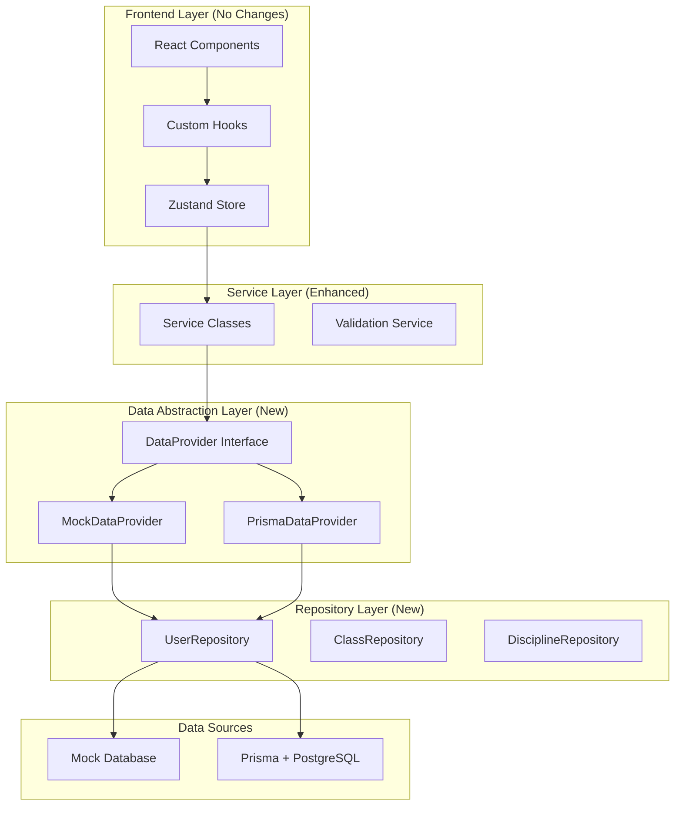

# Design Document - Data Layer Refactor

## Overview

Este diseño establece una arquitectura de capas que permite una migración seamless desde mock data hacia sistemas de producción (Prisma + NextAuth). La arquitectura se basa en el patrón Repository con abstracción de providers, manteniendo compatibilidad total con el frontend existente.

## Architecture



## Components and Interfaces

### 1. DataProvider Interface

```typescript
// lib/data-layer/types.ts
export interface DataProvider {
  users: UserRepository;
  classes: ClassRepository;
  disciplines: DisciplineRepository;
  instructors: InstructorRepository;
  plans: PlanRepository;
  organizations: OrganizationRepository;
}

export interface Repository<T> {
  findMany(params: FindManyParams): Promise<PaginatedResult<T>>;
  findUnique(params: FindUniqueParams): Promise<T | null>;
  create(data: CreateData<T>): Promise<T>;
  update(id: string, data: UpdateData<T>): Promise<T>;
  delete(id: string): Promise<T>;
  count(params: CountParams): Promise<number>;
}
```

### 2. Provider Factory

```typescript
// lib/data-layer/provider-factory.ts
export class DataProviderFactory {
  static create(): DataProvider {
    const provider = process.env.DATA_PROVIDER || "mock";

    switch (provider) {
      case "prisma":
        return new PrismaDataProvider();
      case "mock":
      default:
        return new MockDataProvider();
    }
  }
}
```

### 3. Type Generation System

```typescript
// lib/types/generator.ts
export function createZodSchemaFromType<T>(): z.ZodSchema<T> {
  // Auto-generate Zod schemas from TypeScript interfaces
  // This ensures single source of truth
}

// Usage
export const userSchema = createZodSchemaFromType<User>();
export const classSessionSchema = createZodSchemaFromType<ClassSession>();
```

### 4. API Response Types

```typescript
// lib/api/types.ts
export interface ApiResponse<T> {
  data: T;
  success: boolean;
  error?: ApiError;
  meta?: ResponseMeta;
}

export interface PaginatedApiResponse<T> extends ApiResponse<T[]> {
  pagination: PaginationMeta;
}

export interface ApiError {
  code: string;
  message: string;
  details?: Record<string, any>;
}
```

### 5. Enhanced Service Layer

```typescript
// lib/services/base-service.ts
export abstract class BaseService<T> {
  protected dataProvider: DataProvider;
  protected abstract repositoryName: keyof DataProvider;

  constructor() {
    this.dataProvider = DataProviderFactory.create();
  }

  protected get repository(): Repository<T> {
    return this.dataProvider[this.repositoryName] as Repository<T>;
  }

  async findMany(params: FindManyParams): Promise<PaginatedApiResponse<T>> {
    try {
      const result = await this.repository.findMany(params);
      return {
        data: result.items,
        success: true,
        pagination: result.pagination,
      };
    } catch (error) {
      return this.handleError(error);
    }
  }

  private handleError(error: any): ApiResponse<any> {
    // Standardized error handling
    return {
      data: [],
      success: false,
      error: {
        code: error.code || "UNKNOWN_ERROR",
        message: error.message || "An unexpected error occurred",
      },
    };
  }
}
```

## Data Models

### Core Entity Structure

```typescript
// lib/types/core.ts
export interface BaseEntity {
  id: string;
  createdAt?: string;
  updatedAt?: string;
}

export interface User extends BaseEntity {
  firstName: string;
  lastName: string;
  email: string;
  phone?: string;
  role?: UserRole;
  membership?: Membership;
  // ... other properties
}

// Single source of truth - all schemas generated from these
```

### Repository Implementations

```typescript
// lib/data-layer/repositories/user-repository.ts
export class MockUserRepository implements UserRepository {
  async findMany(params: FindManyParams): Promise<PaginatedResult<User>> {
    // Current mock implementation
  }
}

export class PrismaUserRepository implements UserRepository {
  async findMany(params: FindManyParams): Promise<PaginatedResult<User>> {
    // Prisma implementation - same interface
    const result = await prisma.user.findMany({
      where: params.where,
      skip: params.skip,
      take: params.take,
      orderBy: params.orderBy,
    });

    return {
      items: result,
      pagination: {
        page: params.page,
        limit: params.limit,
        total: await prisma.user.count({ where: params.where }),
        totalPages: Math.ceil(total / params.limit),
      },
    };
  }
}
```

## Error Handling

### Standardized Error System

```typescript
// lib/errors/types.ts
export enum ErrorCode {
  VALIDATION_ERROR = "VALIDATION_ERROR",
  NOT_FOUND = "NOT_FOUND",
  UNAUTHORIZED = "UNAUTHORIZED",
  FORBIDDEN = "FORBIDDEN",
  INTERNAL_ERROR = "INTERNAL_ERROR",
}

export class AppError extends Error {
  constructor(
    public code: ErrorCode,
    message: string,
    public details?: Record<string, any>
  ) {
    super(message);
  }
}
```

### Error Boundary Integration

```typescript
// lib/errors/handler.ts
export class ErrorHandler {
  static handle(error: unknown): ApiError {
    if (error instanceof AppError) {
      return {
        code: error.code,
        message: error.message,
        details: error.details,
      };
    }

    // Log unexpected errors
    console.error("Unexpected error:", error);

    return {
      code: ErrorCode.INTERNAL_ERROR,
      message: "An unexpected error occurred",
    };
  }
}
```

## Testing Strategy

### Repository Testing

```typescript
// tests/repositories/user-repository.test.ts
describe("UserRepository", () => {
  let mockRepo: MockUserRepository;
  let prismaRepo: PrismaUserRepository;

  beforeEach(() => {
    mockRepo = new MockUserRepository();
    prismaRepo = new PrismaUserRepository();
  });

  test("both implementations return same structure", async () => {
    const mockResult = await mockRepo.findMany({ page: 1, limit: 10 });
    const prismaResult = await prismaRepo.findMany({ page: 1, limit: 10 });

    expect(mockResult).toMatchStructure(prismaResult);
  });
});
```

### Migration Testing

```typescript
// tests/migration/compatibility.test.ts
describe("Migration Compatibility", () => {
  test("switching providers maintains API compatibility", async () => {
    // Test that switching from mock to prisma doesn't break anything
    const mockProvider = new MockDataProvider();
    const prismaProvider = new PrismaDataProvider();

    // Same operations should work with both
    const mockUsers = await mockProvider.users.findMany({});
    const prismaUsers = await prismaProvider.users.findMany({});

    expect(mockUsers).toHaveProperty("items");
    expect(prismaUsers).toHaveProperty("items");
  });
});
```

### Integration Testing

```typescript
// tests/integration/api.test.ts
describe("API Integration", () => {
  test("API responses maintain structure after refactor", async () => {
    const response = await fetch("/api/users");
    const data = await response.json();

    expect(data).toMatchSchema(PaginatedApiResponseSchema);
  });
});
```

## Migration Strategy

### Phase 1: Infrastructure Setup

1. Create data layer interfaces and base classes
2. Implement type generation system
3. Set up error handling framework
4. Create testing infrastructure

### Phase 2: Repository Implementation

1. Extract current mock logic into MockDataProvider
2. Create repository interfaces
3. Implement MockRepository classes
4. Update services to use new abstraction

### Phase 3: API Standardization

1. Implement standardized API response types
2. Update all API routes to use new types
3. Enhance error handling in APIs
4. Add comprehensive API testing

### Phase 4: Prisma Preparation

1. Create PrismaDataProvider skeleton
2. Implement PrismaRepository classes
3. Set up database schema
4. Create migration scripts

### Phase 5: Authentication Integration

1. Create auth middleware
2. Integrate with existing role system
3. Update validation service
4. Test auth flows

### Deployment Strategy

```typescript
// Environment-based provider switching
// .env.local (development)
DATA_PROVIDER=mock

// .env.production
DATA_PROVIDER=prisma
DATABASE_URL=postgresql://...
NEXTAUTH_SECRET=...
```

This design ensures that migration is literally changing an environment variable, exactly as requested.
