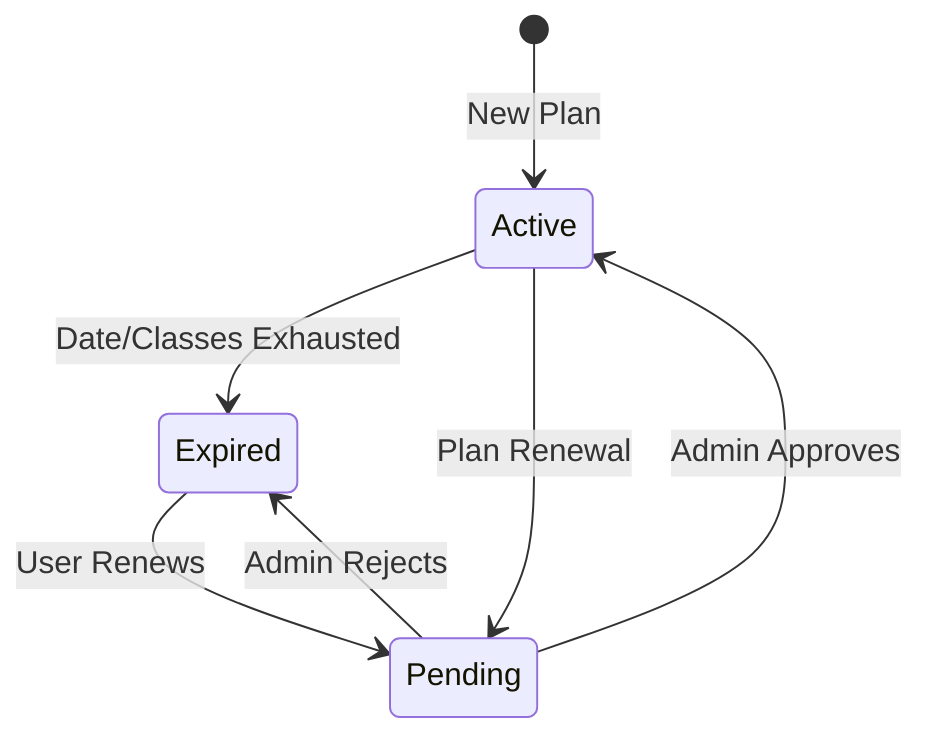
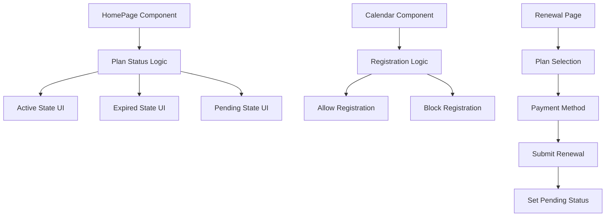

# Design Document

## Overview

The plan renewal system provides a comprehensive solution for managing student plan lifecycles, including automatic expiration detection, renewal workflows, and pending validation states. The system integrates with the existing data layer and UI components to provide seamless user experiences across different plan states.

## Architecture

### State Management Flow



### Component Architecture



## Components and Interfaces

### Core Functions

#### Plan Status Detection

```typescript
function getPlanStatus(
  user: FitCenterUserProfile
): "active" | "expired" | "pending" {
  // Check for pending renewal first
  if (user.membership.pendingRenewal) return "pending";

  // Check expiration conditions
  const now = new Date();
  const endDate = new Date(user.membership.currentPeriodEnd);
  const remainingClasses =
    user.membership.centerStats.currentMonth.remainingClasses;

  if (now > endDate || remainingClasses <= 0) return "expired";

  return "active";
}
```

#### Registration Permission Check

```typescript
function canUserRegisterForClasses(user: FitCenterUserProfile): boolean {
  return getPlanStatus(user) === "active";
}
```

### UI Components Updates

#### HomePage Component

- **Plan Details Section**: Display status-specific badges and messages
- **Classes Section**: Show appropriate messages based on plan status
- **Action Buttons**: Context-sensitive buttons (Renovar, Gestionar clases, etc.)

#### Calendar Component

- **Registration Controls**: Enable/disable based on plan status
- **Status Messages**: Display appropriate messages for non-active states

#### Renewal Page Component

- **Plan Selection**: Allow users to choose new plans
- **Payment Method**: Capture payment preferences
- **Submission**: Create pending renewal requests

### Data Models

#### Enhanced Membership Interface

```typescript
interface FitCenterMembership {
  // ... existing fields
  pendingRenewal?: PendingRenewalRequest;
}

interface PendingRenewalRequest {
  requestedPlanId: string;
  requestedPaymentMethod: "contado" | "transferencia" | "debito" | "credito";
  requestDate: string; // ISO 8601
}
```

## Error Handling

### Plan Status Validation

- **Missing Membership Data**: Default to "expired" state
- **Invalid Dates**: Handle malformed date strings gracefully
- **Network Errors**: Show appropriate error messages during renewal

### Renewal Process Errors

- **Plan Selection**: Validate plan availability and pricing
- **Payment Method**: Ensure valid payment method selection
- **Submission Failures**: Provide retry mechanisms and error feedback

### UI Error States

- **Loading States**: Show skeleton components during data fetching
- **Empty States**: Display appropriate messages when no data is available
- **Error States**: Show user-friendly error messages with recovery options

## Testing Strategy

### Unit Tests

- **Plan Status Logic**: Test all combinations of expiration conditions
- **Registration Permission**: Verify access control logic
- **Date Calculations**: Test edge cases for date comparisons

### Integration Tests

- **Renewal Flow**: End-to-end testing of the renewal process
- **State Transitions**: Verify proper state changes throughout the system
- **UI Updates**: Ensure UI reflects current plan status accurately

### User Acceptance Tests

- **Expired Plan Experience**: Verify users see appropriate messages and actions
- **Pending Plan Experience**: Test pending validation workflow
- **Renewal Process**: Validate complete renewal user journey

## Implementation Phases

### Phase 1: Core Logic Implementation

1. Update `getPlanStatus` function with pending state logic
2. Implement `canUserRegisterForClasses` function
3. Add pending renewal data structures to types

### Phase 2: UI Component Updates

1. Update HomePage component with status-specific rendering
2. Modify calendar component to handle registration restrictions
3. Implement status badges and messages

### Phase 3: Renewal Page Implementation

1. Create functional renewal page with plan selection
2. Implement payment method selection
3. Add renewal request submission logic

### Phase 4: Integration and Testing

1. Integrate all components with existing data layer
2. Add comprehensive error handling
3. Implement loading and empty states

## Security Considerations

### Access Control

- Verify user authentication before allowing renewals
- Validate plan selection against available options
- Ensure payment method data is handled securely

### Data Validation

- Validate all user inputs on renewal form
- Sanitize plan and payment method selections
- Verify user permissions for plan changes

### State Management

- Prevent unauthorized state transitions
- Validate pending renewal requests
- Ensure consistent state across components
