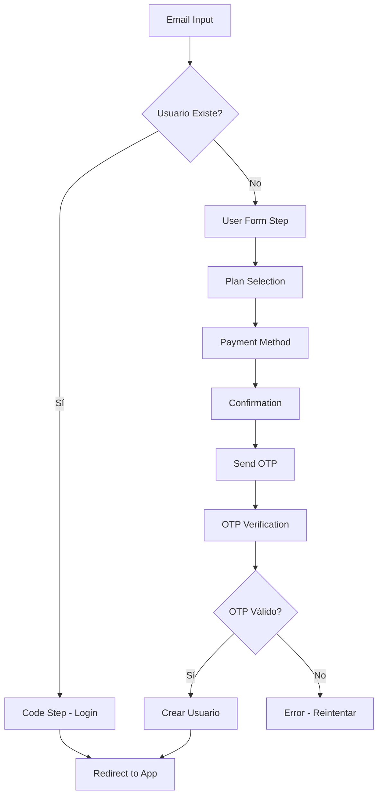
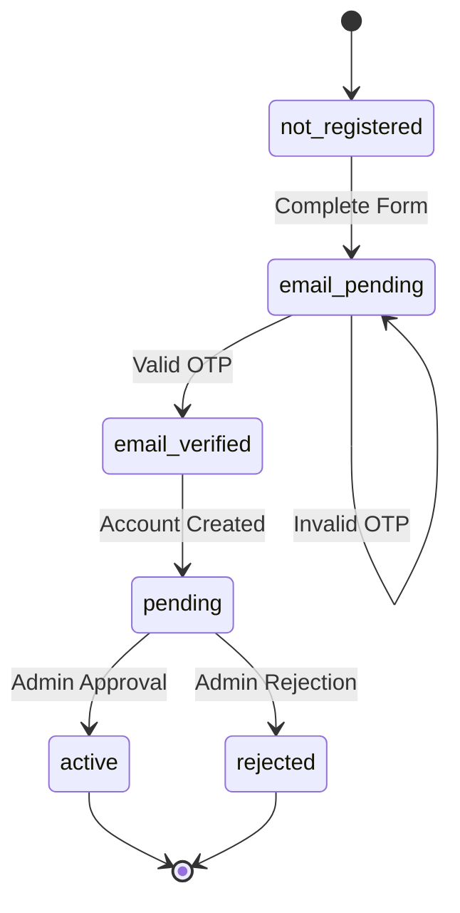

# Documentación del Flujo de Autenticación con OTP

## 📋 Índice

1. [Resumen del Sistema](#resumen-del-sistema)
2. [Arquitectura del Flujo](#arquitectura-del-flujo)
3. [Casos de Uso Detallados](#casos-de-uso-detallados)
4. [Estados y Transiciones](#estados-y-transiciones)
5. [Integración con Servicios Externos](#integración-con-servicios-externos)
6. [Configuración de Resend](#configuración-de-resend)
7. [Integración con Better-Auth](#integración-con-better-auth)
8. [Integración con Auth.js (NextAuth)](#integración-con-authjs-nextauth)
9. [Manejo de Errores](#manejo-de-errores)
10. [Consideraciones de Seguridad](#consideraciones-de-seguridad)

---

## 🎯 Resumen del Sistema

El sistema de autenticación implementa un flujo de registro con verificación de email obligatoria mediante OTP (One-Time Password). Garantiza que solo usuarios con emails válidos puedan acceder a la aplicación.

### Características Principales:

- ✅ Verificación de email obligatoria
- ✅ Persistencia de datos durante el proceso
- ✅ Recuperación de sesión si se abandona el flujo
- ✅ Integración con sistema de notificaciones admin
- ✅ Mock OTP para desarrollo, preparado para servicios reales

---

## 🏗️ Arquitectura del Flujo

### Componentes Principales:

```
app/auth/
├── page.tsx                    # Controlador principal del flujo
├── _hooks/
│   └── use-auth-reducer.ts     # Estado y lógica del formulario
└── _components/
    ├── email-step.tsx          # Paso 1: Ingreso de email
    ├── code-step.tsx           # Paso 2: Código para usuarios existentes
    ├── user-form-step.tsx      # Paso 2: Datos personales (nuevos)
    ├── plan-selection-step.tsx # Paso 3: Selección de plan
    ├── payment-method-step.tsx # Paso 4: Método de pago
    ├── confirmation-step.tsx   # Paso 5: Confirmación de datos
    └── otp-verification-step.tsx # Paso 6: Verificación OTP
```

### Flujo de Datos:



---

## 📚 Casos de Uso Detallados

### 🟢 Caso 1: Usuario Nuevo - Flujo Exitoso

**Precondiciones:**

- Email no existe en el sistema
- Usuario completa todos los pasos
- OTP es válido

**Flujo:**

```
1. Email: usuario@example.com
2. Datos: Juan Pérez, +56912345678, Masculino
3. Plan: Plan Básico
4. Pago: Transferencia
5. Confirmación: Revisa datos → Continuar
6. OTP: Recibe código → Ingresa 123456 → Verificar
7. Resultado: Usuario creado con status "pending"
```

**Datos Guardados:**

```json
{
  "id": "usr_juan_1234567890",
  "email": "usuario@example.com",
  "firstName": "Juan",
  "lastName": "Pérez",
  "phone": "+56912345678",
  "membership": {
    "status": "pending",
    "membershipType": "Básico",
    "planId": "plan_basico_001"
  }
}
```

**Resultado:**

- ✅ Usuario aparece en notificaciones admin
- ✅ Redirige a `/app` (con acceso limitado hasta aprobación)
- ✅ localStorage limpio

---

### 🔵 Caso 2: Usuario Existente - Login Exitoso

**Precondiciones:**

- Email existe en el sistema
- Usuario ingresa código correcto

**Flujo:**

```
1. Email: existente@example.com
2. Sistema detecta usuario existente
3. Code Step: Ingresa código de acceso
4. Resultado: Acceso directo a la app
```

**Resultado:**

- ✅ Redirige a `/app` inmediatamente
- ✅ No se crea nuevo usuario

---

### 🟡 Caso 3: Usuario Nuevo - Abandono y Recuperación

**Precondiciones:**

- Usuario inicia registro pero no completa
- Datos guardados en localStorage

**Flujo:**

```
1. Usuario completa pasos 1-3
2. Cierra navegador/pestaña
3. Regresa a /auth
4. Sistema detecta datos guardados
5. Continúa desde paso 4 (Payment Method)
6. Completa flujo normalmente
```

**Datos Persistidos:**

```json
{
  "authFormData": {
    "email": "usuario@example.com",
    "firstName": "Juan",
    "selectedPlan": "plan_basico_001"
  },
  "authCurrentStep": "4"
}
```

**Resultado:**

- ✅ UX mejorada - no pierde progreso
- ✅ Datos recuperados automáticamente

---

### 🔴 Caso 4: OTP Inválido - Error y Reintento

**Precondiciones:**

- Usuario completa pasos 1-5
- Ingresa OTP incorrecto

**Flujo:**

```
1. Usuario completa hasta confirmación
2. Recibe OTP: 123456
3. Ingresa código incorrecto: 111111
4. Sistema muestra error: "Código incorrecto"
5. Usuario puede:
   - Reintentar con código correcto
   - Solicitar reenvío de código
```

**Manejo de Errores:**

```typescript
try {
  const isValidOTP = await verifyOTP(email, otp);
  if (!isValidOTP) {
    throw new Error("Código incorrecto. Intenta nuevamente.");
  }
} catch (error) {
  setError(error.message);
  // Usuario permanece en paso 6
}
```

**Resultado:**

- ❌ Usuario NO se crea
- ⚠️ Permanece en paso OTP
- 🔄 Puede reintentar

---

### 🟠 Caso 5: Timeout de OTP

**Precondiciones:**

- Usuario recibe OTP pero no lo ingresa a tiempo
- Código expira (simulado)

**Flujo:**

```
1. Usuario recibe OTP
2. Espera más de 10 minutos (timeout simulado)
3. Intenta ingresar código expirado
4. Sistema rechaza código
5. Usuario debe solicitar nuevo código
```

**Implementación Futura:**

```typescript
// Verificar expiración del código
const isExpired = Date.now() - otpTimestamp > 10 * 60 * 1000;
if (isExpired) {
  throw new Error("El código ha expirado. Solicita uno nuevo.");
}
```

---

## 🔄 Estados y Transiciones

### Estados del Usuario:

| Estado           | Descripción                         | Acciones Disponibles     |
| ---------------- | ----------------------------------- | ------------------------ |
| `not_registered` | Email no existe                     | Completar registro       |
| `email_pending`  | Datos guardados, OTP pendiente      | Verificar OTP            |
| `email_verified` | OTP verificado, cuenta creada       | Esperar aprobación admin |
| `pending`        | Cuenta creada, esperando aprobación | Acceso limitado a app    |
| `active`         | Aprobado por admin                  | Acceso completo          |
| `rejected`       | Rechazado por admin                 | No puede acceder         |

### Transiciones:



---

## 🔌 Integración con Servicios Externos

### Opciones de Integración:

1. **Resend** (Recomendado para emails)
2. **Better-Auth** (Autenticación completa)
3. **Auth.js/NextAuth** (Autenticación tradicional)
4. **Twilio** (SMS OTP)
5. **SendGrid** (Email alternativo)

---

## 📧 Configuración de Resend

### 1. Instalación:

```bash
npm install resend
```

### 2. Variables de Entorno:

```env
# .env.local
RESEND_API_KEY=re_your_api_key_here
FROM_EMAIL=noreply@yourdomain.com
```

### 3. Configuración del Servicio:

```typescript
// lib/services/email-service.ts
import { Resend } from "resend";

const resend = new Resend(process.env.RESEND_API_KEY);

export class EmailService {
  static async sendOTP(email: string, otp: string) {
    try {
      const { data, error } = await resend.emails.send({
        from: process.env.FROM_EMAIL!,
        to: [email],
        subject: "Código de verificación - BlackSheep CrossFit",
        html: `
          <div style="font-family: Arial, sans-serif; max-width: 600px; margin: 0 auto;">
            <h2>Verifica tu email</h2>
            <p>Tu código de verificación es:</p>
            <div style="background: #f5f5f5; padding: 20px; text-align: center; font-size: 32px; font-weight: bold; letter-spacing: 8px; margin: 20px 0;">
              ${otp}
            </div>
            <p>Este código expira en 10 minutos.</p>
            <p>Si no solicitaste este código, ignora este email.</p>
          </div>
        `,
      });

      if (error) {
        throw new Error(`Error sending email: ${error.message}`);
      }

      return { success: true, messageId: data?.id };
    } catch (error) {
      console.error("Email service error:", error);
      throw error;
    }
  }
}
```

### 4. Integración en el Flujo:

```typescript
// app/auth/page.tsx
import { EmailService } from "@/lib/services/email-service";

// Reemplazar función mock
const sendOTP = async (email: string) => {
  try {
    // Generar OTP real
    const otp = Math.floor(100000 + Math.random() * 900000).toString();

    // Guardar OTP en base de datos o cache (Redis)
    await saveOTPToCache(email, otp);

    // Enviar por email
    await EmailService.sendOTP(email, otp);

    toast({
      title: "Código enviado",
      description: `Hemos enviado un código de verificación a ${email}`,
    });
  } catch (error) {
    throw new Error("Error al enviar el código. Intenta nuevamente.");
  }
};

const verifyOTP = async (email: string, otp: string) => {
  try {
    // Verificar contra base de datos/cache
    const isValid = await verifyOTPFromCache(email, otp);

    if (!isValid) {
      throw new Error("Código incorrecto o expirado.");
    }

    // Limpiar OTP usado
    await clearOTPFromCache(email);

    return true;
  } catch (error) {
    throw error;
  }
};
```

### 5. Cache de OTP (Redis recomendado):

```typescript
// lib/services/otp-cache.ts
import Redis from "ioredis";

const redis = new Redis(process.env.REDIS_URL);

export async function saveOTPToCache(email: string, otp: string) {
  const key = `otp:${email}`;
  await redis.setex(key, 600, otp); // 10 minutos
}

export async function verifyOTPFromCache(email: string, otp: string) {
  const key = `otp:${email}`;
  const storedOTP = await redis.get(key);
  return storedOTP === otp;
}

export async function clearOTPFromCache(email: string) {
  const key = `otp:${email}`;
  await redis.del(key);
}
```

---

## 🔐 Integración con Better-Auth

### 1. Instalación:

```bash
npm install better-auth
```

### 2. Configuración:

```typescript
// lib/auth.ts
import { betterAuth } from "better-auth";
import { prismaAdapter } from "better-auth/adapters/prisma";
import { prisma } from "./prisma";

export const auth = betterAuth({
  database: prismaAdapter(prisma, {
    provider: "postgresql",
  }),
  emailAndPassword: {
    enabled: true,
    requireEmailVerification: true,
  },
  emailVerification: {
    sendOnSignUp: true,
    expiresIn: 60 * 10, // 10 minutes
    sendVerificationEmail: async ({ user, url, token }) => {
      // Integrar con Resend
      await EmailService.sendVerificationEmail(user.email, url, token);
    },
  },
  session: {
    expiresIn: 60 * 60 * 24 * 7, // 7 days
    updateAge: 60 * 60 * 24, // 1 day
  },
});
```

### 3. Integración en el Flujo:

```typescript
// app/auth/page.tsx
import { auth } from "@/lib/auth";

const handleContinue = async () => {
  // ... lógica existente ...

  if (currentStep === 6) {
    try {
      // Crear usuario con Better-Auth
      const { data, error } = await auth.api.signUpEmail({
        body: {
          email: formData.email,
          password: generateTempPassword(), // O usar passwordless
          name: `${formData.firstName} ${formData.lastName}`,
        },
      });

      if (error) {
        throw new Error(error.message);
      }

      // Crear perfil extendido en tu sistema
      const userProfile = {
        authId: data.user.id,
        email: formData.email,
        firstName: formData.firstName,
        lastName: formData.lastName,
        phone: formData.phone,
        membership: {
          status: "pending",
          planId: formData.selectedPlan,
          // ... resto de datos
        },
      };

      await createUserProfile(userProfile);

      router.push("/app");
    } catch (error) {
      setError(error.message);
    }
  }
};
```

---

## 🔑 Integración con Auth.js (NextAuth)

### 1. Instalación:

```bash
npm install next-auth
npm install @auth/prisma-adapter
```

### 2. Configuración:

```typescript
// app/api/auth/[...nextauth]/route.ts
import NextAuth from "next-auth";
import { PrismaAdapter } from "@auth/prisma-adapter";
import { prisma } from "@/lib/prisma";
import EmailProvider from "next-auth/providers/email";

const handler = NextAuth({
  adapter: PrismaAdapter(prisma),
  providers: [
    EmailProvider({
      server: {
        host: process.env.EMAIL_SERVER_HOST,
        port: process.env.EMAIL_SERVER_PORT,
        auth: {
          user: process.env.EMAIL_SERVER_USER,
          pass: process.env.EMAIL_SERVER_PASSWORD,
        },
      },
      from: process.env.EMAIL_FROM,
      sendVerificationRequest: async ({ identifier, url, provider }) => {
        // Usar Resend para enviar email de verificación
        await EmailService.sendVerificationEmail(identifier, url);
      },
    }),
  ],
  callbacks: {
    async signIn({ user, account, profile, email, credentials }) {
      // Lógica personalizada de sign-in
      return true;
    },
    async session({ session, user }) {
      // Agregar datos personalizados a la sesión
      const userProfile = await getUserProfile(user.id);
      session.user.profile = userProfile;
      return session;
    },
  },
  pages: {
    signIn: "/auth",
    verifyRequest: "/auth/verify-request",
  },
});

export { handler as GET, handler as POST };
```

### 3. Integración en el Flujo:

```typescript
// app/auth/page.tsx
import { signIn } from "next-auth/react";

const handleContinue = async () => {
  if (currentStep === 5) {
    // En lugar de enviar OTP manual, usar NextAuth
    const result = await signIn("email", {
      email: formData.email,
      redirect: false,
    });

    if (result?.error) {
      setError("Error al enviar email de verificación");
      return;
    }

    // Guardar datos del formulario para después de la verificación
    await saveFormDataForLater(formData);

    // Redirigir a página de verificación
    router.push("/auth/verify-request");
  }
};
```

---

## ⚠️ Manejo de Errores

### Tipos de Errores:

```typescript
enum AuthErrorType {
  INVALID_EMAIL = "INVALID_EMAIL",
  EMAIL_SEND_FAILED = "EMAIL_SEND_FAILED",
  INVALID_OTP = "INVALID_OTP",
  EXPIRED_OTP = "EXPIRED_OTP",
  USER_ALREADY_EXISTS = "USER_ALREADY_EXISTS",
  NETWORK_ERROR = "NETWORK_ERROR",
  VALIDATION_ERROR = "VALIDATION_ERROR",
}

class AuthError extends Error {
  constructor(
    public type: AuthErrorType,
    message: string,
    public retryable: boolean = false
  ) {
    super(message);
    this.name = "AuthError";
  }
}
```

### Manejo por Tipo:

```typescript
const handleAuthError = (error: AuthError) => {
  switch (error.type) {
    case AuthErrorType.INVALID_OTP:
      setError("Código incorrecto. Intenta nuevamente.");
      // Permitir reintento
      break;

    case AuthErrorType.EXPIRED_OTP:
      setError("El código ha expirado. Solicita uno nuevo.");
      // Ofrecer reenvío
      break;

    case AuthErrorType.EMAIL_SEND_FAILED:
      setError("Error al enviar email. Verifica tu conexión.");
      // Ofrecer reintento
      break;

    default:
      setError("Error inesperado. Contacta soporte.");
  }
};
```

---

## 🛡️ Consideraciones de Seguridad

### 1. Validación de Email:

- ✅ Verificación de formato
- ✅ Verificación de dominio (opcional)
- ✅ Lista negra de dominios temporales

### 2. OTP Security:

- ✅ Códigos de 6 dígitos
- ✅ Expiración en 10 minutos
- ✅ Un solo uso por código
- ✅ Rate limiting (máximo 3 intentos)

### 3. Protección contra Ataques:

- ✅ Rate limiting en envío de OTP
- ✅ Validación de entrada
- ✅ Sanitización de datos
- ✅ CSRF protection

### 4. Privacidad:

- ✅ No logs de OTP en producción
- ✅ Limpieza de datos sensibles
- ✅ Encriptación de datos en tránsito

---

## 🚀 Próximos Pasos

### Mejoras Recomendadas:

1. **Implementar servicio real de email** (Resend)
2. **Agregar rate limiting** para OTP
3. **Implementar cache Redis** para OTP
4. **Agregar métricas** de conversión
5. **Implementar A/B testing** en el flujo
6. **Agregar soporte SMS** como alternativa
7. **Implementar 2FA** para usuarios admin

### Monitoreo:

```typescript
// Métricas a trackear
const metrics = {
  registration_started: "Usuario inició registro",
  registration_completed: "Usuario completó registro",
  otp_sent: "OTP enviado",
  otp_verified: "OTP verificado",
  registration_abandoned: "Usuario abandonó registro",
  otp_failed: "OTP falló verificación",
};
```

---

## 📞 Soporte

Para dudas sobre la implementación:

- 📧 Email: dev@blacksheep.com
- 📚 Docs: `/docs/auth-flow-documentation.md`
- 🐛 Issues: GitHub Issues
- 💬 Chat: Slack #dev-auth

---

_Última actualización: Enero 2025_
